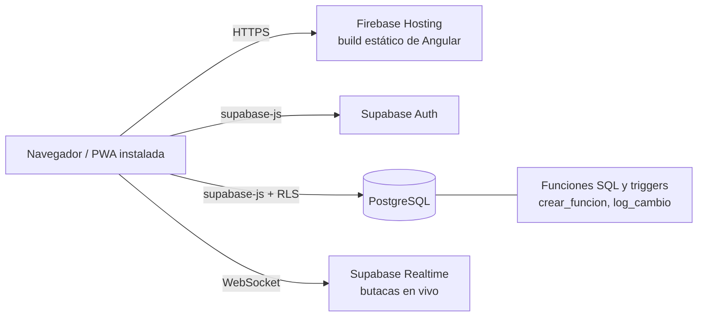
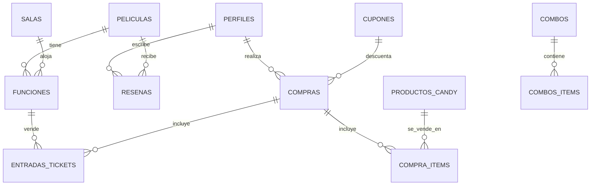

# Sistema de Cine · TP1 Programación IV

Aplicación web (PWA) para un establecimiento de cine: cartelera, programación de funciones con asignación automática de salas, candy bar y, próximamente, compra de entradas con mapa de butacas en tiempo real, QR y fidelización.

- **URL desplegada:** https://tp1programacion-3f7a9.web.app
- **Repositorio:** https://github.com/luisortellado2601/TP1PrograIV
- **Estado del proyecto:** en desarrollo por sprints. Ver [Estado de avance](#estado-de-avance).

## Usuarios de prueba

| Rol | Email | Contraseña |
|---|---|---|
| Gerente (administra todo) | _completar_ | _completar_ |
| Empleado (panel de administración) | _completar_ | _completar_ |
| Cliente | _completar_ | _completar_ |

## Tecnologías

| Área | Tecnología |
|---|---|
| Framework | Angular 22 (componentes standalone, signals, control flow `@if` / `@for`) |
| Backend como servicio | Supabase: Auth, PostgreSQL, Row Level Security y Realtime |
| PWA | `@angular/service-worker` + `manifest.webmanifest` |
| Hosting | Firebase Hosting (build estático) |
| Pruebas | Vitest (`ng test`) |

## Cómo ejecutarlo

```bash
npm install
ng serve          # desarrollo en http://localhost:4200
ng build          # build de producción en dist/TP1PrograIV
ng test           # pruebas unitarias
```

**Configuración de Supabase:** la URL y la clave pública (`publishable key`) están en `src/environments/environment.ts`. Es una clave pensada para el navegador: la seguridad de los datos la garantizan las políticas RLS de la base. Nunca debe versionarse una clave `service_role`.

**Despliegue:**

```bash
ng build
firebase deploy --only hosting
```

## Arquitectura



La aplicación es una SPA sin servidor propio. La lógica que debe ser inviolable (que dos funciones no se solapen, que una butaca no se venda dos veces, quién puede leer o escribir cada dato) **vive en la base de datos**, no en Angular. Así, aunque alguien saltee la interfaz, las reglas se siguen cumpliendo.

### Estructura del código

```
src/app/
├── componentes/
│   ├── cartelera/          Portada con buscador y filtro por género
│   ├── pelicula-detalle/   Ficha de la película
│   ├── login/ register/    Acceso y alta de usuarios
│   ├── navbar/             Navegación según el rol
│   ├── candy-cliente/      Candy bar con carrito (cliente)
│   ├── admin/              Panel principal de administración
│   ├── peliculas/          ABM de películas y preventa
│   ├── admin-candy/        ABM de productos del candy
│   ├── admin-funciones/    Programación de funciones (asignación automática)
│   ├── selector-horario/   Selector de hora reutilizable (@Input / @Output)
│   └── ventana-confirmacion/  Ventana de confirmación centrada (@Input / @Output)
├── services/               auth, peliculas, candy, funciones (acceso a Supabase)
├── models/                 pelicula.ts, funcion.ts
├── guards/                 auth-guard, admin-guard
├── directives/             edad-color, destacado-color
└── pipes/                  formato-duracion, formato-puntos
```

### Rutas

| Ruta | Acceso | Carga |
|---|---|---|
| `/cartelera` | Público | Lazy |
| `/pelicula-detalle/:id` | Público | Lazy |
| `/login`, `/register` | Público | Lazy |
| `/candy-cliente` | Usuario con sesión (`authGuard`) | Lazy |
| `/admin` | Empleado o gerente (`adminGuard`) | Lazy |
| `/peliculas`, `/admin-candy`, `/admin-funciones` | Empleado o gerente (`adminGuard`) | Lazy |

## Modelo de datos



| Grupo | Tablas |
|---|---|
| Usuarios | `perfiles` (rol, datos personales, puntos, crédito) |
| Cartelera | `peliculas`, `salas`, `funciones` |
| Venta | `compras`, `entradas_tickets`, `compra_items`, `reservas_butacas` |
| Candy | `productos_candy`, `combos`, `combos_items` |
| Promociones y fidelización | `cupones`, `canjes_puntos`, `movimientos_credito`, `alertas_estreno` |
| Configuración | `configuracion`, `precios_formato` |
| Contenido y auditoría | `resenas`, `logs_actividad` |

## Reglas de negocio garantizadas en la base

| Regla | Cómo se garantiza |
|---|---|
| Nunca dos funciones a la vez en la misma sala, con **30 minutos** de margen entre una y otra | Constraint de exclusión `funciones_sin_solape` (índice GiST sobre sala y rango de tiempo) |
| Asignación automática de sala | Función SQL `crear_funcion`: calcula el fin según la duración de la película y usa la primera sala libre; si ninguna sirve, devuelve un error claro |
| Una butaca no se vende dos veces | Índice único parcial sobre `(funcion_id, fila, columna)` para entradas no canceladas |
| Solo existen butacas válidas | Constraint `butaca_valida` (ver distribución abajo) |
| Cada usuario solo ve lo suyo | Políticas RLS por tabla |
| Registro de actividad | Trigger `log_cambio` sobre funciones, precios, configuración, productos y combos |

### Distribución de la sala

Todas las salas son iguales: filas **A a T**, con tres columnas de **4, 20 y 4** butacas. Los asientos se numeran del 1 al 30 dejando dos pasillos (los números 5 y 26 no existen).

- **Fila J:** butacas accesibles (2, 10 y 2 por columna). La fila **K** queda vacía y funciona como pasillo.
- **Filas R, S y T:** butacas VIP, con precio mayor y diferenciadas en el mapa.
- Cada sala tiene 518 butacas: 504 normales o VIP y 14 accesibles.

La grilla se genera por código, ya que es idéntica en todas las salas.

## Seguridad

- **Roles:** `cliente`, `empleado` y `gerente`. Un empleado o gerente accede al panel de administración; solo el gerente puede editar perfiles y roles.
- **RLS activo en todas las tablas.** El catálogo (películas, salas, funciones, productos, combos, precios) es de lectura pública y solo lo modifica un administrador. Compras, puntos y crédito solo los ve su dueño o un administrador.
- **Las compras no se insertan directo desde el cliente.** Se harán mediante una función SQL segura que valida precios y cupones, de modo que nadie pueda fijar su propio precio. Esto permite además la compra **anónima** sin abrir escritura pública.

## Temas de la materia aplicados

| Tema | Dónde |
|---|---|
| Lazy loading | Todas las rutas usan `loadComponent` (`app.routes.ts`) |
| Directivas | `EdadColorDirective` (color según clasificación) y `DestacadoColorDirective` (resalta combos) |
| Pipes | `FormatoDuracionPipe` (minutos a horas) y `FormatoPuntosPipe` |
| ReactiveFormsModule | Formulario de programación de funciones (`admin-funciones`), con validadores propios de fecha y de rango |
| Observables | `FuncionesService` devuelve Observables (`from` y `map`); el componente los consume con `subscribe` (`next`, `error` y `complete`) |
| Input y Output | `selector-horario` y `ventana-confirmacion` reciben datos con `@Input` y avisan a la pantalla con `@Output` |

Además se usan **signals** (`signal`, `computed`), **Signal Forms** en login, registro, películas y candy, guards de ruta y PWA.

## Decisiones técnicas

1. **Lógica crítica en SQL y no en Angular.** Es la única forma de garantizar que las reglas se cumplan siempre, aun con datos cargados por fuera de la app.
2. **Un QR por compra.** El mismo código sirve para ingresar a la función y para retirar el candy. La compra guarda estados separados (`estado_entrada` y `estado_candy`), de modo que validar la entrada no consume el retiro de comida, y cada uno deja de funcionar una vez usado.
3. **Formato e idioma por función.** Una misma película puede proyectarse en 2D castellano y en 3D subtitulada, por eso esos datos pertenecen a la función y no a la película.
4. **Funciones recurrentes como filas independientes.** El admin elige días, horario y período; el sistema crea una función por cada fecha, cada una con su sala asignada. Si en una fecha no hay sala libre, esa se informa y las demás se crean igual.
5. **Selector de horario y fechas propios.** El cliente pidió evitar calendarios desplegables y scroll: la hora se elige con botones y la fecha se escribe con máscara `DD/MM/AAAA`.
6. **Grilla de butacas por código.** Como todas las salas son iguales, no se guarda cada butaca en la base; lo que se persiste son las entradas vendidas y las reservas temporales.
7. **Reserva temporal de butacas.** Mientras un usuario elige, las butacas quedan reservadas unos minutos y el resto las ve ocupadas en tiempo real (Supabase Realtime).
8. **Compra anónima.** `usuario_id` es opcional en compras y entradas. Los anónimos ven solo el aviso de restricción de edad; no se les pide identificación.
9. **Dos enfoques de formularios.** Los formularios existentes usan Signal Forms; el nuevo panel de funciones usa ReactiveFormsModule por ser el tema visto en clase.

## Estado de avance

Referencias: ✅ terminado · 🔧 parcial · ⏳ pendiente.

| Requisito | Estado | Detalle |
|---|---|---|
| Registro, login y logout | ✅ | Con mail, nombre, apellido, nacimiento, sangre, ojos y vacaciones |
| Roles, guards y RLS | ✅ | Cliente, empleado y gerente |
| ABM de películas | ✅ | Con géneros múltiples, clasificación y preventa |
| ABM del candy (productos y categorías) | ✅ | |
| Combos | 🔧 | Tablas creadas; falta el ABM |
| Funciones y asignación automática de salas | ✅ | Con recurrencia y validación en la base |
| Cartelera con buscador y filtro por género | ✅ | |
| Las 3 películas más vendidas primero | 🔧 | Hoy muestra las tres primeras; falta el ranking real por ventas |
| Detalle de película con funciones y reseñas | 🔧 | Ficha lista; falta mostrar funciones y reseñas (tabla lista) |
| "Próximamente" y alertas de estreno | ⏳ | Tabla `alertas_estreno` creada |
| Compra con mapa de butacas en tiempo real | ⏳ | Estructura de datos y reglas listas |
| PDF con QR, validación por empleados y carga manual del código | ⏳ | |
| Cupón de bienvenida (20 %) y cupón para mayores de 50 | 🔧 | Configurables en la base; falta aplicarlos en la compra |
| Restricción de edad | 🔧 | Clasificación cargada; falta el bloqueo y el aviso en la compra |
| Puntos, canjes y crédito | ⏳ | Tablas creadas |
| Cancelación hasta 2 horas antes, con crédito | ⏳ | |
| Preventa por película | 🔧 | Campos cargados; falta aplicar el precio en la compra |
| "Mis películas" | ⏳ | |
| Reportes, gráficos y exportación a PDF y Excel | ⏳ | |
| Log de actividad | 🔧 | Se registra en la base; falta la pantalla para consultarlo |
| PWA | 🔧 | Instalable y con service worker; faltan las notificaciones push |
| Despliegue con URL funcional | ✅ | Firebase Hosting |

### Funcionalidad opcional

Mapa del cine que indique la sala de la entrada comprada. El cliente aún no dio luz verde, por lo que queda fuera del alcance actual.
