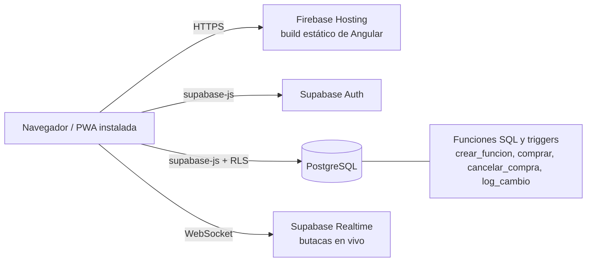
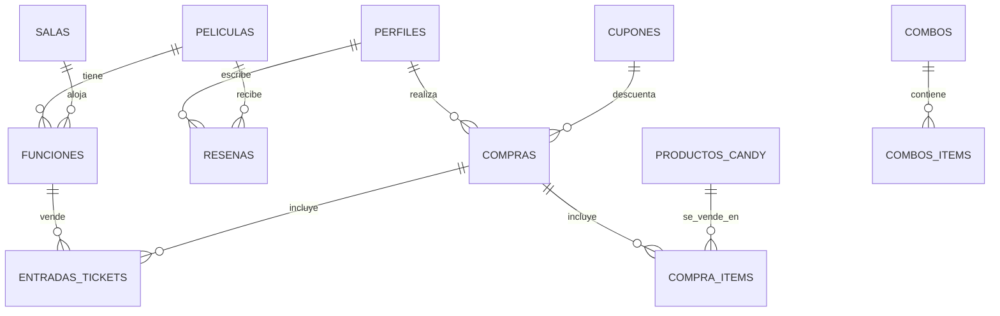

# Arquitectura — Sistema de Cine

Documento técnico: cómo está armado el sistema, qué garantiza la base de datos y por qué se tomó cada decisión de diseño. Para qué hace la app (sin jerga técnica) ver [FUNCIONALIDAD.md](FUNCIONALIDAD.md); para el detalle de requerimientos por sprint ver [REQUERIMIENTOS.md](REQUERIMIENTOS.md).

## Tecnologías

| Área | Tecnología |
|---|---|
| Framework | Angular 22 (componentes standalone, signals, control flow `@if` / `@for`) |
| Backend como servicio | Supabase: Auth, PostgreSQL, Row Level Security y Realtime |
| PWA | `@angular/service-worker` + `manifest.webmanifest` |
| Hosting | Firebase Hosting (build estático) |
| Pruebas | Vitest (`ng test`) |

## Arquitectura general



La aplicación es una SPA sin servidor propio. La lógica que debe ser inviolable (que dos funciones no se solapen, que una butaca no se venda dos veces, quién puede leer o escribir cada dato) **vive en la base de datos**, no en Angular. Así, aunque alguien saltee la interfaz, las reglas se siguen cumpliendo.

## Estructura del código

```
src/app/
├── componentes/
│   ├── cartelera/          Portada con buscador y filtro por género
│   ├── pelicula-detalle/   Ficha de la película
│   ├── login/ register/    Acceso y alta de usuarios
│   ├── navbar/             Navegación según el rol
│   ├── candy-cliente/      Candy bar con carrito, cupón y pago simulado (candy solo, sin butacas)
│   ├── admin/              Panel principal de administración
│   ├── peliculas/          ABM de películas y preventa
│   ├── admin-candy/        ABM de productos del candy
│   ├── admin-funciones/    Programación de funciones (asignación automática)
│   ├── admin-configuracion/  Precios, recargo VIP, puntos y cupones
│   ├── admin-validacion/   Panel de empleados: escaneo de QR por cámara o código manual, entrada y candy por separado
│   ├── admin-log/          Log de actividad (solo gerente): quién hizo qué cambio y cuándo
│   ├── selector-horario/   Selector de hora reutilizable (@Input / @Output)
│   ├── ventana-confirmacion/  Ventana de confirmación centrada (@Input / @Output)
│   ├── mapa-butacas/       Mapa de butacas en tiempo real con reserva temporal
│   ├── compra/             Compra de entradas + candy: cupón, bloqueo por edad, pago simulado y PDF con QR
│   ├── mis-compras/        Historial de compras del usuario, con cancelación hasta 2 horas antes
│   └── fidelizacion/       Perfil: puntos, crédito, canje de recompensas, historial de canjes y "Mis películas"
├── services/               auth, peliculas, candy, funciones, configuracion, resenas, butacas, compras, alertas, push, validacion, fidelizacion, logs (acceso a Supabase)
├── models/                 pelicula.ts, funcion.ts, configuracion.ts, resena.ts, butaca.ts, compra.ts, canje.ts, log.ts
├── guards/                 auth-guard, admin-guard, gerente-guard
├── directives/             edad-color, destacado-color
└── pipes/                  formato-duracion, formato-puntos
```

## Rutas

| Ruta | Acceso | Carga |
|---|---|---|
| `/cartelera` | Público | Lazy |
| `/pelicula-detalle/:id` | Público | Lazy |
| `/login`, `/register` | Público | Lazy |
| `/butacas/:funcionId` | Público (también compradores anónimos) | Lazy |
| `/compra/:funcionId` | Público (también compradores anónimos) | Lazy |
| `/candy-cliente` | Público (candy solo, sin butacas; también anónimos) | Lazy |
| `/mis-compras`, `/fidelizacion` | Solo usuarios registrados (`authGuard`) | Lazy |
| `/admin` | Empleado o gerente (`adminGuard`) | Lazy |
| `/peliculas`, `/admin-candy`, `/admin-funciones`, `/admin-configuracion`, `/admin-validacion` | Empleado o gerente (`adminGuard`) | Lazy |
| `/admin-log` | Solo gerente (`gerenteGuard`) | Lazy |
| `**` (cualquier otra) | Redirige a `/cartelera` | — |

## Modelo de datos



| Grupo | Tablas |
|---|---|
| Usuarios | `perfiles` (rol, datos personales, puntos, crédito) |
| Cartelera | `peliculas`, `salas`, `funciones` |
| Venta | `compras`, `entradas_tickets`, `compra_items`, `reservas_butacas` |
| Candy | `productos_candy`, `combos`, `combos_items` |
| Promociones y fidelización | `cupones`, `canjes_puntos`, `movimientos_credito`, `alertas_estreno` |
| Configuración | `configuracion`, `precios_formato` |
| Contenido y auditoría | `resenas`, `logs_actividad` |

## Reglas de negocio garantizadas en la base

| Regla | Cómo se garantiza |
|---|---|
| Nunca dos funciones a la vez en la misma sala, con **30 minutos** de margen entre una y otra | Constraint de exclusión `funciones_sin_solape` (índice GiST sobre sala y rango de tiempo) |
| Asignación automática de sala | Función SQL `crear_funcion`: calcula el fin según la duración de la película y usa la primera sala libre; si ninguna sirve, devuelve un error claro |
| Una butaca no se vende dos veces | Índice único parcial sobre `(funcion_id, fila, columna)` para entradas no canceladas |
| Reserva temporal (5 min) y máximo de 6 butacas por compra | Función SQL `reservar_butaca` (con clave primaria por función, fila y columna: dos personas no pueden reservar la misma butaca) |
| Precio, recargo VIP, preventa, cupón, edad y puntos siempre calculados por el servidor | Función SQL `comprar`: recibe solo lo elegido (butacas reservadas, candy y código de cupón) y devuelve el total y el QR ya validados |
| Cancelación solo hasta 2 horas antes, sin devolución de dinero | Función SQL `cancelar_compra`: valida dueño y horario límite, libera la butaca, invalida el QR y otorga el crédito |
| Canje de puntos siempre validado y descontado por el servidor | Función SQL `canjear_puntos`: valida que el usuario tenga los puntos suficientes y los descuenta. Si es candy, genera directamente una compra real a $0 con su QR; si es una entrada, guarda un voucher pendiente (no toca `credito_extra`, que es solo de cancelaciones) |
| El voucher de entrada gratis se usa una sola vez | `comprar` (parámetro `p_usar_voucher`) busca con `for update` un voucher propio sin consumir, descuenta su valor antes de calcular los puntos de esa compra (para no generar puntos sobre algo pagado con puntos) y lo marca consumido al confirmarse |
| Solo existen butacas válidas | Constraint `butaca_valida` (ver distribución abajo) |
| Cada usuario solo ve lo suyo | Políticas RLS por tabla |
| Registro de actividad | Trigger `log_cambio` sobre funciones, precios, configuración, productos, combos, películas, cupones y las actualizaciones de compras (validar entrada/candy, cancelar) |
| Solo el gerente puede ver el log de actividad | Política RLS de `logs_actividad` restringida a `rol = 'gerente'` (no alcanza con ocultar el link en el menú) |

### Distribución de la sala

Todas las salas son iguales: filas **A a T**, con tres columnas de **4, 20 y 4** butacas. Los asientos se numeran del 1 al 30 dejando dos pasillos (los números 5 y 26 no existen).

- **Fila J:** butacas accesibles (2, 10 y 2 por columna). La fila **K** queda vacía y funciona como pasillo.
- **Filas R, S y T:** butacas VIP, con precio mayor y diferenciadas en el mapa.
- Cada sala tiene 518 butacas: 504 normales o VIP y 14 accesibles.
- Hay **5 salas** cargadas (Sala 1 a Sala 5).

La grilla se genera por código, ya que es idéntica en todas las salas.

## Seguridad

- **Roles:** `cliente`, `empleado` y `gerente`. Un empleado o gerente accede al panel de administración; solo el gerente puede editar perfiles y roles, y es el único que puede ver el log de actividad.
- **RLS activo en todas las tablas.** El catálogo (películas, salas, funciones, productos, combos, precios) es de lectura pública y solo lo modifica un administrador. Compras, puntos y crédito solo los ve su dueño o un administrador.
- **Las compras no se insertan directo desde el cliente.** Se hacen mediante la función SQL `comprar`, que valida precios, recargo VIP, preventa, cupón y edad, de modo que nadie pueda fijar su propio precio. Esto permite además la compra **anónima** sin abrir escritura pública.

## Temas de la materia aplicados

| Tema | Dónde |
|---|---|
| Lazy loading | Todas las rutas usan `loadComponent` (`app.routes.ts`) |
| Directivas | `EdadColorDirective` (color según clasificación) y `DestacadoColorDirective` (resalta combos) |
| Pipes | `FormatoDuracionPipe` (minutos a horas) y `FormatoPuntosPipe` |
| ReactiveFormsModule | Formulario de programación de funciones (`admin-funciones`), con validadores propios de fecha y de rango |
| Observables | `FuncionesService` devuelve Observables (`from` y `map`); el componente los consume con `subscribe` (`next`, `error` y `complete`) |
| Input y Output | `selector-horario` y `ventana-confirmacion` reciben datos con `@Input` y avisan a la pantalla con `@Output` |

Además se usan **signals** (`signal`, `computed`), **Signal Forms** en login, registro, películas y candy, guards de ruta y PWA.

## Decisiones técnicas

1. **Lógica crítica en SQL y no en Angular.** Es la única forma de garantizar que las reglas se cumplan siempre, aun con datos cargados por fuera de la app.
2. **Un QR por compra.** El mismo código sirve para ingresar a la función y para retirar el candy. La compra guarda estados separados (`estado_entrada` y `estado_candy`), de modo que validar la entrada no consume el retiro de comida, y cada uno deja de funcionar una vez usado.
3. **Formato e idioma por función.** Una misma película puede proyectarse en 2D castellano y en 3D subtitulada, por eso esos datos pertenecen a la función y no a la película.
4. **Funciones recurrentes como filas independientes.** El admin elige días, horario y período; el sistema crea una función por cada fecha, cada una con su sala asignada. Si en una fecha no hay sala libre, esa se informa y las demás se crean igual.
5. **Selector de horario y fechas propios.** El cliente pidió evitar calendarios desplegables y scroll: la hora se elige con botones y la fecha se escribe con máscara `DD/MM/AAAA`.
6. **Grilla de butacas por código.** Como todas las salas son iguales, no se guarda cada butaca en la base; lo que se persiste son las entradas vendidas y las reservas temporales.
7. **Reserva temporal de butacas.** Mientras un usuario elige, las butacas quedan reservadas unos minutos y el resto las ve ocupadas en tiempo real (Supabase Realtime).
8. **Compra anónima.** `usuario_id` es opcional en compras y entradas. Los anónimos ven solo el aviso de restricción de edad; no se les pide identificación.
9. **Dos enfoques de formularios.** Los formularios existentes usan Signal Forms; el panel de funciones usa ReactiveFormsModule por ser el tema visto en clase.
10. **El log de actividad guarda la foto final de cada fila, no un diff.** El trigger `log_cambio` inserta `to_jsonb(coalesce(new, old))` en cada INSERT/UPDATE/DELETE. Para saber *qué* cambió puntualmente en una fila de `compras` (validar entrada, entregar candy o cancelar, ya que las tres son un UPDATE), la pantalla `/admin-log` compara cada registro contra el estado anterior de esa misma compra dentro de lo que trajo la consulta, en vez de pedirle ese trabajo a la base.
11. **El trigger de auditoría en `compras` solo escucha UPDATE, no INSERT.** Si también logueara cada alta, el log de actividad del gerente se llenaría con cada venta a un cliente común, tapando las acciones administrativas (crear función, modificar precio, validar QR) que son las que importa auditar.
